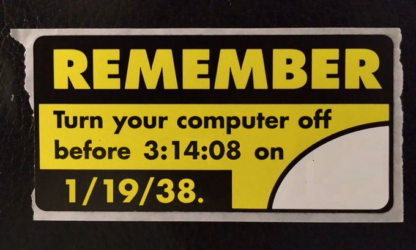

# IPD 14 illumos and Y2038

## Introduction

The Year 2038 problem (Y2038) is a shorthand for the class of problems
related to the use of a 32-bit `time_t` in 32-bit illumos programs,
libraries, and even some kernel modules designed and implemented when
`time_t` was actually 32-bit.  2038 is the year 2^31-1 seconds after the UNIX
epoch of GMT-midnight January 1, 1970.

While illumos has eliminated 32-bit kernels in x86/amd64 environments, 32-bit
userland code (commands and libraries) are still supported. Indeed, the vast
majority, approximately 90%, of illumos utilities are only built 32-bit.

The use of 32-bit code may impact other areas beyond time_t. For example,
there may be applications that have not been updated to deal with large
files. Another problem may be the use of a 32-bit ino_t, as zfs supports
many more files on a single filesystem.

## Possible solutions

The problem of large files was addressed within a 32-bit system by adding
a new transitional compilation environment for 32-bit software, see
lfcompile(5). This approach was specifically to allow code to access 64-bit
quantities at a time when a full 64-bit option was not available. It
would be possible to define an additional transitional compilation
environment for a larger time_t (or any other properties). Such an
approach has recently been added to Linux, for example. However, that
is aimed at supporting 32-bit hardware beyond 2038.

However, any approach of that type requires software to opt-in, and requires
applications to be rebuilt from source. Existing binaries cannot be fixed, as
the 32-bit quantities are embedded.

Given that recompilation is required anyway, and we only support 64-bit
hardware, it seems much easier to rebuild as 64-bit and be done with it.
Such an approach would also address any other 32-bit limitations.

## Other areas impacted

It's possible that there may be areas beyond userland applications that
are impacted. Such as:

* 32-bit timestamps in the UFS on-disk format
* 32-bit timestamps in utmp, wtmp, lastlog, information (w(1), uptime(1) etc.)
* 32-bit timestamps used for "uniqueness" via uniqtime32() in the kernel
* ZFS clamps times to 32bit in zfs_setattr(), but says the problem year is 2039
* `KRB5_KDB_EXPIRATION` is suspiciously Jan 1st 2038
* NFS `nfs_allow_preepoch_time` tunable uses
* Olson zic/zoneinfo needs updating to the "new" format (I think libc
  `localtime.c` talks about this)

## Implementation

The basic plan is to simply rebuild all libraries and utilities as 64-bit.
This approach is operationally simple, most utilities can be attacked
independently, in any order, potentially in parallel, and the work spread
across multiple contributors.

In most cases, it is envisaged that a new 64-bit utility be created, in
the relevant 64-bit subdirectory, so that it can be tested. Once found
acceptable, the 32-bit utility will be removed and replaced by the new
version.

## Issues

Utilities built as 64-bit will need to be tested functionally, independent
of testing for Y2038 itself.

In some cases, 64-bit applications can cause problems as they are not
constrained by the 32-bit address space, and will consume excessive
resources rather than fail (the 64-bit ls is not shipped in SmartOS for
this reason, it appears).

Oracle Solaris are somewhat ahead of us here, and we can take note of
issues they have reported. For example, issues hit during the 32->64
conversion were people who had installed 32-bit PAM modules without 64-bit
versions (though this could happen with any interface that allows for
external plugin modules), and impacts of the larger fd limit in 64-bit
programs (such as huge select masks or loops over all possible fd's needing
to be converted to closefrom()/fdwalk() calls). There's a [public
discussion](https://blogs.oracle.com/solaris/moving-oracle-solaris-to-lp64-bit-by-bit-v2)
available.

Known items with issues:

* pam_smb_passwd
* topo plugins

## Legacy applications

The plan above only covers the artefacts from illumos-gate. Going beyond
that requires involvement of the various illumos distributions.

The distributions will need to rebuild the applications and packages they
ship (in many cases the applications will already be 64-bit clean, due to
exposure to other 64-bit operating systems).

In addition, the distributions and their communities will be a conduit for
identifying any applications that cannot be recompiled. This information
would give visibility into the scale of the remaining problem, which would
inform any decisions as to whether any further work is necessary.

## Workarounds

For those applications that cannot be rebuilt, some workarounds have been
suggested. They're mentioned here for completeness.

From Andrew Gabriel:

I remember thinking about this some years ago, and had some ideas to
keep some existing programs working, although nothing works for all
possible use cases. These would work for programs that simply use it to
create timestamped log records, but not if they write time_t values out
to files for storage and use much later, or exchange values with other
programs. Might still work in some cases if they do calculations on
time_t too.

One was to have an environment variable which allowed you to respecify
what date the 32 bit (time_t)0 is.

Another was to assume that it is unsigned, so you lose the ability to
represent 1901-1969 in exchange for being able to represent 2035-2106.
Again, might want an environment variable to enable or disable this
behaviour, although not having it enabled after the 32 bit cutoff date
would seem pointless.

These should be relatively trivial to implement. (I did implement
something similar with an LD_PRELOAD interceptor shim in Solaris 8 and
Solaris 10, although it was for a slightly different purpose.)

## Testing
