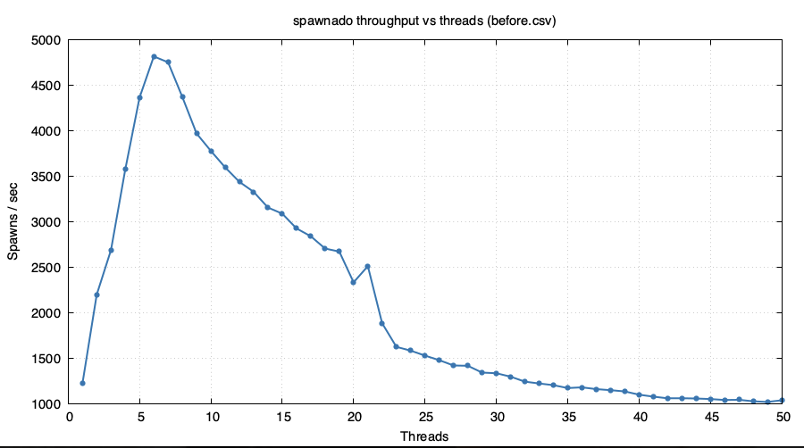
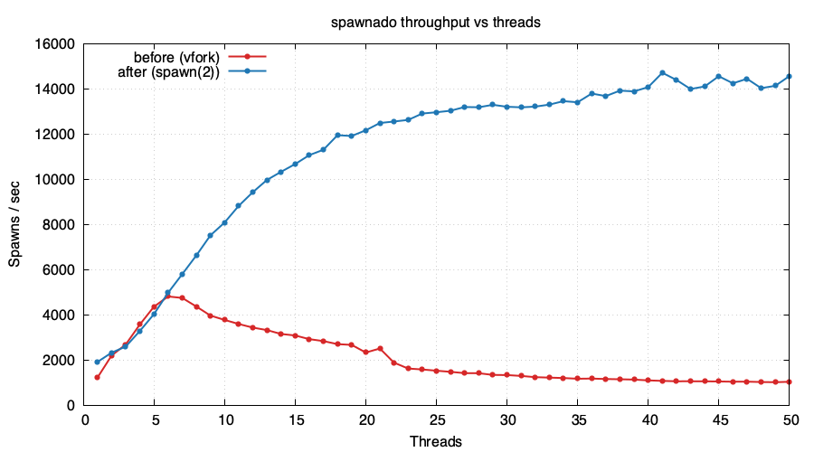

:showtitle:
:toc: left
:numbered:
:icons: font
:state: published
:revremark: State: {state}
:authors: Andy Fiddaman <illumos@fiddaman.net>
:sponsor: Robert Mustacchi <rm@fingolfin.org>
:source-highlighter: pygments
:stem: latexmath
ifdef::env-github[]
:tip-caption: :bulb:
:note-caption: :information_source:
:important-caption: :heavy_exclamation_mark:
:caution-caption: :fire:
:warning-caption: :warning:
endif::[]

= IPD 64 A Native spawn(2) System Call
{authors}

[cols="3"]
|===
|Authors: {authors}
|Sponsor: {sponsor}
|State: {state}
|===

Almost every process on the system begins its life through some
combination of fork and exec. Over the years, several attempts have
been made to reduce the overhead of this sequence, from `vfork(2)` in
BSD to `posix_spawn(3C)` in POSIX. Today, illumos implements
`posix_spawn(3C)` as a library function, wrapping `vfork(2)` and
`execve(2)`, inheriting the scalability problems of both.

This IPD proposes the introduction of a native `spawn(2)` system call
that combines process creation and program execution into a single
kernel operation. By avoiding the intermediate address space sharing
and thread serialisation that `vfork(2)` requires, a kernel-level
spawn can offer better performance and scalability, especially for
multi-threaded processes that have a large number of threads or
spawn children concurrently.

== Background

=== Process Creation on Unix

The original mechanism for starting a new process on Unix is the
`fork(2)` and `exec(2)` pair. The parent calls `fork(2)` to create a
copy of itself and the child then calls `exec(2)` to replace its
address space with a new program. This model carries significant cost
because `fork(2)` must duplicate the entire address space of the
parent. Even with copy-on-write optimisations for the page tables,
this becomes increasingly expensive as the parent process grows
larger. On illumos the cost is compounded since the kernel must
duplicate any swap reservations -- a `fork(2)` from a large process
can transiently require twice the swap that the parent alone needs.

`vfork(2)` was introduced in BSD as a cheaper alternative. Rather than
duplicating the address space, the child runs directly in the parent's
address space. The parent is suspended until the child either calls
`exec(2)` or `_exit(2)`. This gets around page table copying and swap
reservation, but introduces its own problems. Since the child shares
the parent's memory, it must not modify data or call functions that
might corrupt the parent's state. The window between `vfork(2)` and
`exec(2)` is therefore very constrained. Dynamic linking complicates
things further because, if another thread in the parent held the
dynamic linker's lock when `vfork(2)` was called, that lock is now
owned by a defunct thread. Any attempt by the child to resolve a
symbol will deadlock.

On illumos, all fork variants are implemented through the `forksys`
system call (`SYS_forksys`, 142). This covers POSIX `fork(2)` which
duplicates only the calling thread (fork-one semantics), the older
`forkall(2)` which duplicates every LWP, and `vfork(2)`. Before the
child process can be created, the kernel must stop all other LWPs in
the parent process via `holdlwps()` and wait for them to reach a safe
point. For `fork(2)`, this is necessary so that kernel stacks can be
cloned and for `vfork(2)`, the child is borrowing the parent's address
space, so other threads must not be allowed to modify it concurrently.
In every case, every thread in the parent process must be stopped
before the operation can proceed. The more threads a process has, the
longer this takes.

Having to wait for all threads to return from the kernel also provides
some interesting
https://www.illumos.org/issues/17688[opportunities for deadlocks].

=== posix_spawn(3C)

The `posix_spawn(3C)` interface was introduced in POSIX to provide a
way to create a new process and execute a program in a single logical
operation. It was originally motivated by the needs of embedded
systems without an MMU, where `fork(2)` cannot be implemented at all,
but it has since seen wide adoption as a general-purpose process
creation API.

POSIX defines two entry points: `posix_spawn(3C)`, which takes an
explicit path to the executable, and `posix_spawnp(3C)`, which
searches the `PATH` environment variable. Both allow the caller to
specify a limited but well-defined set of operations to be performed
between process creation and program execution, expressed as _file
actions_ and _spawn attributes_. File actions describe operations on
file descriptors: open, close, dup2, closefrom, chdir, and fchdir.
Spawn attributes control process properties such as the signal mask,
signal dispositions, process group, scheduling parameters, and session
membership. illumos also provides several non-portable extensions
(denoted by the `_NP` suffix):

* `POSIX_SPAWN_SETSIGIGN_NP` -- set specified signals to `SIG_IGN`
* `POSIX_SPAWN_NOSIGCHLD_NP` -- do not post `SIGCHLD` to the parent
* `POSIX_SPAWN_WAITPID_NP` -- child is not waitable by the parent
  unless explicitly via `waitpid(2)`
* `POSIX_SPAWN_NOEXECERR_NP` -- on exec failure, exit with status 127
  rather than reporting the error to the parent

Since the permitted operations are constrained, the intermediate child
process does not need to be exposed to the caller.

=== Current illumos Implementation

The current illumos `posix_spawn(3C)` is implemented entirely in libc,
and works as follows:

. If any file actions require `closefrom`, a directory buffer is
  pre-allocated (since memory cannot be allocated after `vfork(2)`).
. `vforkx(2)` is called with flags derived from the spawn attributes
  (`FORK_NOSIGCHLD`, `FORK_WAITPID`).
. In the child, spawn attributes are applied (signal masks, process
  group, scheduling parameters, et al.).
. File actions are executed in order.
. `execve(2)` is called with the specified path, arguments, and
  environment.
. If `execve(2)` fails, the child exits with a special `_EVAPORATE`
  status that allows the parent to distinguish exec failure from
  successful child termination.

Because the implementation is built on `vfork(2)`, it inherits all of
the problems described above. In particular:

* All other LWPs in the parent must be stopped before the child can be
  created. This serialises all `posix_spawn(3C)` calls against every
  other thread in the process.
* The child executes in the parent's address space, so all functions
  called between `vfork(2)` and `execve(2)` must be internal to libc
  and must not be exported as global symbols, to avoid invoking the
  dynamic linker.
* Only one `vfork(2)` child can be active at a time per process,
  since there is only one address space to lend. Multiple threads
  calling `posix_spawn(3C)` concurrently must wait their turn.

Benchmarking a multi-threaded process that repeatedly spawns
`/bin/true`, using a test tool written for the purpose
(https://github.com/citrus-it/spawnado[spawnado]) of exploring
posix_spawn performance, shows that adding threads above a certain
point ends up with the spawn rate decreasing. The bottleneck is the
`holdlwps()` / `continuelwps()` cycle as each spawn must wait for
every other LWP to stop and then restart them all afterwards.

.Spawn throughput vs thread count, current implementation

In the run shown above, throughput peaks at around 4800 spawns/sec
with six threads and falls to roughly 1000 spawns/sec by fifty.

== Proposal

This IPD proposes the introduction of a new `spawn(2)` system call
that performs process creation and program execution as a single
atomic kernel operation. The libc implementation of `posix_spawn(3C)`
will be updated to use this system call rather than the current
`vfork(2)` + `execve(2)` approach. During implementation and testing,
both implementations could co-exist and be selected via a mechanism
such as an environment variable.

=== Advantages of spawn(2)

The new system call will share substantial code with the existing
`cfork()` and `exec_common()` kernel paths but will avoid the
following operations that are unnecessary when the goal is to create a
new process running a new program:

* There is no need to stop other LWPs via
  `holdlwps()`. The parent's address space is not being shared with or
  copied to the child.
* There is no need to duplicate the parent's address space.
  The child will get a fresh address space populated by `exec`.
* Watchpoint manipulation can be avoided entirely. `vfork(2)` must
  clear watchpoints on the shared address space and restore them later.
* There are no shared memory segments to duplicate or share.
* No need to clone threads/LWPs; the kernel will create a single new
  LWP for the child directly.
* The parent's full file descriptor table need not be copied wholesale.
  See <<sec-fd>> for more discussion.

The combined effect of skipping these steps will lead to a faster and
more scalable process creation path. Multiple threads in the same
process will be able to call `spawn(2)` concurrently; the only
serialisation will be on the locks that must be held briefly during
process creation (the PID and file descriptor table, for example).

=== High-Level Operation

At a high level, the `spawn(2)` system call will proceed as follows:

. The kernel will copy the argument vector, environment vector, file
  actions, and spawn attributes from the caller's address space into
  kernel memory. This must happen early because the parent's address
  space will not be available to the child.
. A new process structure will be created and initialised from the
  parent, inheriting credentials, resource controls, the contract
  template, and other process-level properties.
. The spawn attributes will be applied: signal mask, signal
  dispositions, process group, scheduling parameters, session, etc.
. File descriptors will be set up for the child, either by copying the
  parent's table and then applying file actions, or by constructing
  the child's table directly. See <<sec-fd>>.
. The specified program will be loaded and executed in the new
  process's address space, as with `exec`.
. If the exec succeeds, the system call will return in the parent with
  the child's PID. If the exec fails, the child will be torn down and
  the error returned to the parent.

The parent will not need to wait for the child to exec before it can
resume. However, the system call itself will be synchronous; it will
not return until the child has either successfully begun executing the
new program or failed. This will preserve the existing `posix_spawn(3C)`
error reporting semantics where exec failures can be communicated to
the caller as an error return, except when `POSIX_SPAWN_NOEXECERR_NP`
is set.

[[sec-fd]]
=== File Descriptor Handling

One of the more interesting considerations is how file descriptors are
handled. The current `vfork(2)` approach gives the child direct access
to the parent's file descriptor table. File actions (open, close,
dup2, etc.) are executed in the child, which can  access the parent's
descriptors directly. This works because the parent is suspended
throughout.

With a native `spawn(2)`, we will need to construct the child's file
descriptor table without suspending the parent. The chosen approach is
to take a snapshot of the parent's file descriptor table and apply the
file actions to that snapshot. A copy-on-write scheme is not considered
viable since it would require changes to file descriptor handling
throughout the kernel and the complexity would far outweigh any benefit
for this use case.

Since `spawn(2)` is logically equivalent to a fork followed by an
exec, both close-on-fork and close-on-exec need to be honoured, but
handled at different stages. The wording in POSIX states that file
actions must be applied *as if* in the new process, and then any
file descriptors *from this new set* which are flagged for
close-on-exec must be closed. It is legitimate for a file action to
reference a descriptor that would later be closed on `exec(2)`.
We must therefore:

. Copy the parent's descriptor table, excluding any descriptors
  marked as close-on-fork;
. Apply the file actions in order;
. Close any remaining descriptors that are flagged for close-on-exec.

==== Locking and atomicity

Each entry will be examined and copied while holding that entry's
`uf_lock`; the flags of each descriptor need to be inspected to honour
close-on-fork, so taking `uf_lock` per-fd is necessary anyway. The
per-process `fi_lock` will be taken only briefly, to size the child's
table. Holding `fi_lock` across the whole snapshot would not change the
application-visible consistency and would serialise the copy against
every other thread touching the descriptor table. This approach will
not provide a strictly atomic snapshot of the parent's descriptor table
- between releasing one descriptor's `uf_lock` and acquiring the next,
another thread can complete a modification to the descriptor we have
already processed (or to one we have not yet reached). The snapshot we
produce will therefore be a sequence of per-fd observations rather than
that of the table at a single instant.

Achieving strict atomicity would require something analogous to
`flist_grow()` which acquires `fi_lock` and every `uf_lock` at once
before doing any work. That scales poorly and blocks every other
thread from touching the descriptor table for the duration, which
defeats a lot of the stated advantages of this IPD.

In terms of application-visible consistency, the torn-snapshot
behaviour is considered acceptable since:

* If the application has properly synchronised access to the
  descriptors that `spawn(2)` will care about, there is no race in the
  first place.
* If it has not, the externally observable result of any interleaving
  is indistinguishable from one where the concurrent operation had
  happened a moment before or after the `spawn(2)` call. For example,
  while thread A is in `spawn(2)`, thread B might call `close(3);
  close(100);`. The child may end up with fd 3 open and fd 100 closed
  -- a state that no atomic snapshot would have produced. However,
  this is still ok. An application that needs the child's descriptor
  table to reflect a particular set of descriptors must arrange that
  itself as described below.

Applications that need stronger guarantees should mark the descriptors
in question as close-on-fork or close-on-exec, or use
`posix_spawn_file_actions_addclosefrom_np(3C)` to set a descriptor
ceiling that the spawned child should not inherit.

==== Optimisations

The descriptor table copy is potentially the most expensive part of
`spawn(2)`, particularly for processes with a large number of open
descriptors. There is scope for optimisation here by pre-scanning
the file actions, for example:

* A descriptor that is marked close-on-exec and is not referenced by
  any file action does not need to be copied at all, since it would be
  closed at step 3 above.
* The presence of a `posix_spawn_file_actions_addclosefrom_np(3C)` action
  can be used to bound the descriptor table copy at the `closefrom`
  limit, although care must be taken to account for any
  earlier `posix_spawn_file_actions_adddup2(3C)` actions.

These optimisations are not required for correctness but both will be
included in the implementation. The child's table will also be sized to
cover only the descriptors actually being copied, so a sparse,
high-numbered descriptor in the parent (a common pattern for daemons)
will not cause every spawned child to build an enormous table.

=== The libc/Kernel Boundary

Not all of the work currently done by the libc `posix_spawn(3C)` needs
to move into the kernel, and some work must remain in userland. The
division of responsibilities is expected to be:

==== Before the system call (in libc, parent context)

* Validation of arguments, spawn attributes, and file actions.
* Marshalling the file actions, spawn attributes, and the argv and envp
  vectors into a form suitable for the system call.

==== In the kernel

* Process creation.
* Application of spawn attributes (signals, process group, scheduling,
  session). For the scheduling attributes
  (`POSIX_SPAWN_SETSCHEDULER` and `POSIX_SPAWN_SETSCHEDPARAM`), libc
  will resolve the POSIX scheduling policy and priority in the parent -
  using the same machinery that backs `sched_setscheduler(3C)` - into
  either explicit scheduling class parameters or a class-independent
  priority change, and marshal the result. The child will apply it to
  itself via `parmsset()` or `setthreadprio()`, after any RESETIDS and
  session/process group changes, so that the privilege checks are
  performed against the child's final credentials, matching the
  historical order.
* File descriptor table construction and file action execution.
* `posix_spawnp(3C)` PATH resolution. The PATH search has to be
  performed against the child's current working directory, which may
  have been changed by a CHDIR file action. Doing the search in the
  kernel after the file actions have been applied avoids duplication.
* Program loading and execution (`exec`).
* Error reporting back to the parent.

==== After the system call (in libc, parent context)

* Returning the child PID, or an error as applicable.

The above will no doubt be refined during implementation.

=== Privileges

The existing fork and exec paths check separate basic privileges,
`PRIV_PROC_FORK` and `PRIV_PROC_EXEC`. Since `spawn(2)` performs
both operations it must require both privileges. A process that has
been denied either one must not be able to use `spawn(2)` to bypass
that restriction.

In the implementation, `PRIV_PROC_FORK` will be checked in the parent
during process creation, and `PRIV_PROC_EXEC` will be checked in the
child by the standard exec path. An exec denied for want of privilege
will be reported back to the parent as the error return from
`spawn(2)`, and the partially-constructed child will exit without a
trace.

=== System Call Number

Solaris implemented a `spawn` system call at syscall number 2. This
is the slot historically occupied by `SYS_fork`, which became available
after the fork variants were consolidated into `SYS_forksys` (142).

It is worth considering whether reusing the Solaris number would be
beneficial. Some software, such as the Go runtime and tools like
valgrind, references system call numbers directly and, in principle,
sharing a number could reduce the porting burden for such software. In
practice, however, these tools already need to distinguish between
Solaris and illumos; the system call tables have diverged in many
places and the interface contract of any new `spawn(2)` will be
illumos-specific. Using the same number as Solaris would risk tools
applying incorrect assumptions about the call's arguments and
semantics.

Regardless, illumos has already repurposed syscall 2 for
`SYS_psecflags` (process security flags), so the Solaris number could
not be re-used without displacing an existing system call. Syscall
number 143 has been allocated. Fittingly, this is the slot that
historically held `fork1` before the fork variants were consolidated
into `forksys`.

== Debugger and Tool Support

The introduction of a new process creation mechanism will require
updates to several debugging and observability tools. Unlike `fork(2)`, where the
child initially shares the parent's program text, a successful
`spawn(2)` produces a child that is already running a different
executable in its own address space. Tools that follow process creation
must account for this, and must also consider that the spawned program
may have different credentials, privileges and authorisations.

=== proc(5)

The `/proc` filesystem is the primary mechanism for process
observation and control. As with the DTrace probes, existing
`/proc`-based tooling must continue to work and observable behaviour
should match what consumers see today for an equivalent
`fork(2)` + `exec(2)` pair.

In the parent, `spawn(2)` will be an ordinary system call and will be
subject to the existing `PR_SYSENTRY` / `PR_SYSEXIT` stop mechanisms.

In the child, the behaviour will be the same as if `exec` had been
called:

* All tracing flags will be reset, with the exception of `PR_RLC`
  (run-on-last-close), matching the existing `exec` semantics.
* Watchpoints and breakpoints will be cleared, since the child has a
  new address space.
* `/proc/<pid>/psinfo`, `/proc/<pid>/status`, and the auxv will reflect
  the new program from the moment the child becomes observable.

A debugger that has `PR_FORK` set on the parent will be able to attach
to the child in the usual way; however, unlike `fork(2)`, the child
will become observable only after the new program image has been
loaded. There will be no intermediate state in which the child exists
with the parent's address space or executable.

To enforce this, a new process flag, `SSPAWNING`, will be set on the
child while the spawn is in progress, alongside the existing flags such
as `SFORKING` and `SEXECED`. While `SSPAWNING` is set, `/proc` control
operations on the child will fail with `EBUSY`, exactly as they do for
a system process, since the process is only partially constructed.
The flag will be cleared at the point in exec where the process is
marked as having exec'd (`SEXECED`), after which normal `/proc`
semantics apply.

=== truss(1)

`truss(1)` will need to learn about the new system call so that it can
trace spawn operations. The `-f` follow-fork option will continue to
work as expected for `spawn(2)`, following the spawned child process
even though it begins life running a different program from the
parent.

=== mdb(1)

By default, `mdb(1)` prompts the user about whether to follow the
parent or the child when a `fork(2)` is encountered, and the same
disposition will apply to `spawn(2)`. This will reuse the existing
fork-following control (`::set forkmode`); the default behaviour will
be to ask, as for `fork(2)`.

Unlike a forked child, the child of a spawn is already running a
different program to the parent. When following the child, the
debugger will therefore discard the parent's symbol state and load
that of the new executable, just as it would had the debuggee itself
exec'd.

For kernel debugging, a `::spawn` dcmd in the `genunix` module will
list processes which are currently within `spawn(2)`, showing the child
process, its parent, the address of the in-kernel parameter block and
the path being executed. A child will refer to the parameter block only
until it reports back to its parent, so the listing will be a snapshot
of in-flight operations, useful when inspecting a stuck spawn from a
crash dump or with `kmdb`.

=== DTrace

The `proc` provider's probes are committed interfaces and existing
consumers must continue to observe spawn events through them without
modification. A `spawn(2)` call is logically a fork followed by an
exec, so it will fire the same probes as that sequence would:

* `proc:::create` when the child process is created, with the standard
  arguments identifying the parent and child.
* `proc:::exec` when the new program image is about to be loaded.
* `proc:::exec-success` or `proc:::exec-failure` according to the
  outcome.
* `proc:::start` when the child begins execution in the new program.

No new `proc` provider probes are proposed. In particular, no probe
that duplicates the semantics of `exec-success` will be added.

The kernel will, however, gain a statically defined tracing (`sdt`)
probe for assisting with the diagnosis of failed spawns. A child
whose attribute application, file actions or exec fails will evaporate
without ever having been visible to its parent, so the failure will
otherwise be observable only as the error returned by `posix_spawn(3C)`.
The probe will fire in the context of the failing child:

    sdt:::spawn-error
        arg0: the kspawn_param_t describing the spawn.
        arg1: the stage which failed ("attributes", "file-actions", "exec")
        arg2: the error number

The parameter block will be passed because the probe context is
otherwise unhelpful for identifying the failed target. The child will
die without ever having exec'd, so execname and curpsinfo will still
describe the parent's image.

As with other `sdt` probes, this is an implementation detail rather
than a committed interface.

One observable difference from the `vfork(2)` implementation will
arise when the exec fails. A vfork child returns to userland (briefly,
in the borrowed image) before attempting the exec, and so fires
`proc:::start`. A spawned child that fails to exec will never run in
userland at all and will fire only `proc:::create` and, when it is
torn down, `proc:::exit`.

=== Auditing

The BSM audit subsystem records events for both `fork(2)` (events
`AUE_FORK1`, `AUE_FORKALL`, `AUE_VFORK`) and `exec(2)` (`AUE_EXECVE`).
Since `spawn(2)` combines what are currently two separately audited
operations, a single record must capture sufficient information for
both purposes.

A new audit event, `AUE_SPAWN` (319), will be added, assigned to the
`ps` and `ex` classes to mirror its fork and exec halves. The record
will contain:

* A text token carrying the path of the program that was (or, on
  failure, would have been) executed. For `posix_spawnp(3C)` this is
  the fully resolved path, reported back to the parent by the child
  after the search completes;
* The argument and environment vectors, subject to the same `argv`
  and `arge` audit policies as for exec;
* The standard return token, carrying the child's PID on success or
  the error on failure.

No changes will be needed to `auditreduce(8)`, `praudit(8)` or the
syslog plugin, all of which handle records token-generically, nor to
the XML definitions, which cover only userland-generated events.

== Consumers

A practical advantage of this work is that many programs already use
`posix_spawn(3C)`:

* The default illumos shell (ksh93) uses `posix_spawn(3C)` to
  launch external commands. This means that shell scripts and
  interactive shell sessions will benefit immediately from the
  performance improvement.
* The `popen(3C)` and `system(3C)` library functions are
  implemented in terms of `posix_spawn(3C)`.
* SMF (the Service Management Facility) uses `posix_spawn(3C)` to
  start services.

Because the `spawn(2)` system call will be used transparently through
the existing `posix_spawn(3C)` API, no changes to these consumers will
be required.

However, as a followup to this work, other system components,
particularly any that routinely spawn a lot of sub-processes
(for example `dmake(1)`), should be considered for migration
to use `posix_spawn(3C)`.

== Performance

With the new implementation in place, the same spawnado benchmark on
the same system (and now on non-DEBUG bits in both cases) shows
throughput rising with thread count instead of collapsing. It reaches
around 14,700 spawns/sec at 41 threads and holds between 14,000 and
14,600 through fifty - three times the previous peak rate and fourteen
times the previous fifty-thread rate. The median per-spawn latency at
fifty threads falls from 11.2ms to 769us.

.Spawn throughput vs thread count, before and after

For workloads whose spawning processes are small and single-threaded,
`spawn(2)` performs equivalently to the `vfork(2)` path. A full
(non-DEBUG) build of illumos-gate, around 400,000 process creations,
takes the same time with either implementation underneath.

== Testing

The existing `posix_spawn` test suite was recently expanded and tests
against the `posix_spawn(3C)` API rather than the implementation. The
same tests must continue to pass when the underlying implementation
switches from `vfork(2)` + `execve(2)` to the native `spawn(2)`.

A new os-tests suite will exercise the raw system call interface
directly: it will verify that deliberately corrupt marshalled
structures are rejected with `EINVAL` rather than misbehaving, and that
a child killed in the window between creation and exec is cleanly
waitable and never leaves the parent stuck.

Additional tests will be added to exercise concurrency scenarios that
are expected to improve, such as multiple threads spawning children
simultaneously.

Some behaviour will require manual verification: `truss -f` following a
spawned child into its new program; `mdb` fork-following with each
`forkmode` setting, including a spawn across a privilege boundary
(a set-id program), where the debugger must lose the child
gracefully; audit records with the `argv` and `arge` policies
enabled; and `/proc` consumers (`ps`, `pfiles`, `pstop` and friends)
run against a process spawning in a tight loop.

== Documentation

`spawn(2)` will be a private interface, used only by libc, and
intentionally undocumented; no man page will be written.

